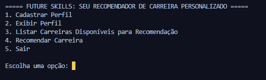
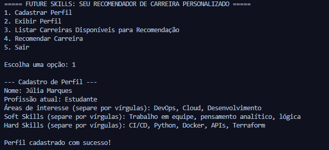
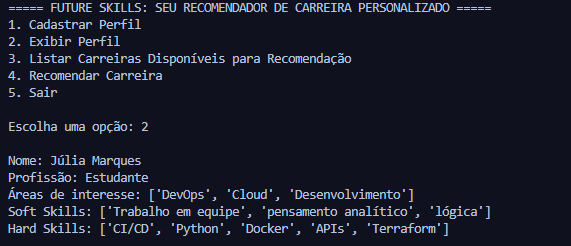
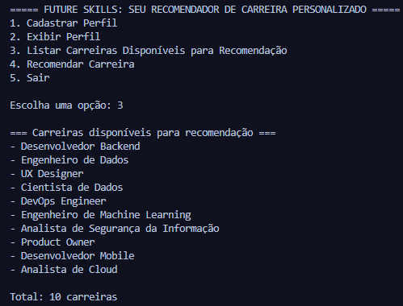
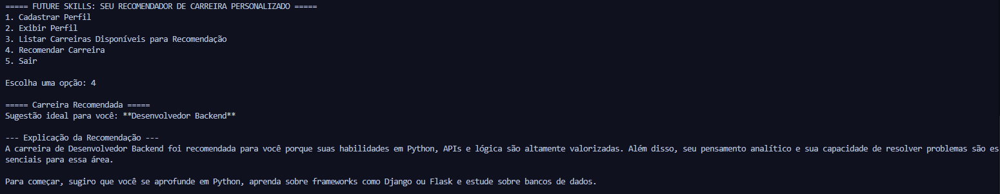

# Future Skills: Seu Recomendador de Carreira Personalizado

## Descrição do Projeto e Propósito

O **Future Skills** é um sistema de linha de comando (CLI) em Python que atua como um assistente de carreira. O seu propósito é ajudar usuários, especialmente estudantes e profissionais em transição, a identificar carreiras na área de tecnologia que sejam compatíveis com seus interesses e habilidades (hard e soft skills).

### Funcionamento

O projeto funciona em duas etapas principais:

1. **Matching de Habilidades**: O usuário cadastra seu perfil. O sistema então compara as habilidades do usuário com uma lista pré-definida de 10 carreiras de tecnologia, usando uma lógica de pontuação simples (`calcular_match`) para encontrar a carreira com maior compatibilidade.

2. **Explicação com IA Generativa**: Após identificar a melhor carreira, o sistema utiliza a API do Google Generative AI (Gemini) para gerar uma explicação personalizada. A IA explica por que aquela carreira é uma boa opção com base no perfil do usuário e sugere uma breve trilha de aprendizado.

---

## Instruções de Execução

Siga os passos abaixo para executar o projeto localmente.

### Pré-requisitos

- Python 3.7+
- Uma chave de API do Google Generative AI (Gemini). Você pode obtê-la [aqui](https://ai.google.dev/).

### Passos

#### 1. Clone o repositório

```bash
git clone https://github.com/seu-usuario/seu-repositorio.git
cd seu-repositorio
```

#### 2. Crie e ative um ambiente virtual (Recomendado)

**Windows:**
```bash
python -m venv venv
.\venv\Scripts\activate
```

**macOS/Linux:**
```bash
python3 -m venv venv
source venv/bin/activate
```

#### 3. Instale as dependências

Crie um arquivo `requirements.txt` na raiz do projeto com o seguinte conteúdo:

```
google-generativeai
python-dotenv
```

Em seguida, instale-o:

```bash
pip install -r requirements.txt
```

#### 4. Configure as variáveis de ambiente

Crie um arquivo chamado `.env` na raiz do projeto e adicione sua chave de API:

```
GOOGLE_API_KEY=SUA_CHAVE_DE_API_AQUI
```

#### 5. Execute a aplicação

```bash
python app.py
```

---

## Estrutura de Arquivos e Classes

O projeto é organizado da seguinte forma, separando a lógica de negócio, a interface do usuário e os modelos de dados:

```
/
|-- app.py                  # Ponto de entrada, controla o menu e o fluxo do usuário.
|-- logica_da_aplicacao.py  # Funções auxiliares (cadastrar, criar carreiras).
|-- models/                 # Diretório para as classes principais.
|   |-- Perfil.py           # Classe Perfil: Armazena dados do usuário.
|   |-- Carreira.py         # Classe Carreira: Define requisitos e calcula o match.
|   |-- Recomendador.py     # Classe Recomendador: Lógica de recomendação e integração com a API Gemini.
|-- .env                    # Arquivo para a chave de API (Ignorado pelo Git).
|-- requirements.txt        # Lista de dependências Python.
|-- screenshots             # Prints do sistema em funcionamento
```

### Classes Principais

#### `Perfil` (models/Perfil.py)
Armazena as informações do usuário (nome, profissão, áreas de interesse, soft skills, hard skills).

#### `Carreira` (models/Carreira.py)
Define uma carreira com seu nome e as hard/soft skills requeridas. Contém o método `calcular_match(perfil)` que retorna uma pontuação de compatibilidade.

#### `Recomendador` (models/Recomendador.py)
- **`recomendar(perfil)`**: Itera sobre todas as carreiras, chama `calcular_match` para cada uma e retorna a carreira com maior pontuação.
- **`explicar_recomendacao(perfil, carreira)`**: Formata os dados do perfil e da carreira em JSON, envia para a API Gemini com um prompt de sistema e retorna a explicação em linguagem natural.

---

## Demonstração

Veja o fluxo de uso da aplicação:

### 1. Menu Principal
Ao iniciar o `app.py`, o usuário é apresentado ao menu principal.



### 2. Cadastro de Perfil (Opção 1)
O usuário seleciona a opção 1 e insere seus dados, incluindo áreas de interesse e listas de habilidades separadas por vírgula.



### 3. Exibição do Perfil (Opção 2)
O usuário pode verificar se os dados foram cadastrados corretamente, formatados como listas.



### 4. Listagem de Carreiras (Opção 3)
O usuário pode listar todas as 10 carreiras que o sistema usa como base para a recomendação.



### 5. Recomendação de Carreira (Opção 4)
Este é o fluxo principal. O sistema:

1. Calcula o melhor "match" (neste caso, "Desenvolvedor Backend").
2. Envia o perfil e a carreira para a API Gemini.
3. Imprime a recomendação e a explicação gerada pela IA, sugerindo também uma trilha de estudos.



---